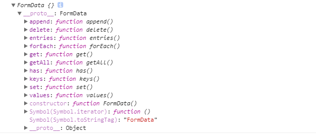

## FormData对象方法的了解和运用

### 1、FormData对象的介绍

XMLHttpRequest是一个浏览器接口，也是现在常用于与后台服务器交互数据的方式。而FormData是2008.02拟XMLHtmlRequest Level 2新增的一个对象，FormData可以提交表单，模拟表单提交，最重要的是它可以上传二进制文件（比如上传图片、xlsx文件等）。

### 2、FormData 基本用法：

     //创建一个FormData实例，表单作为参数传入FromData构造函数
     let form = document.getElementById('form');
     let fd = new FormData(form)

### 3、FormData 对象方法的运用

log一个新创建的FormData实例，可以清楚地看到FormData有哪些方法。FormData对象方法如下图：

              
               
1.append 方法

     //append方法用于对FormData对象添加键值对
     fd.append('key', 'value')

2.delete 方法

     //delete方法删除FormData对象中的指定属性
     fd.delete('key')
     
3.entries 方法

     //entries方法是遍历FormData对象中属性对象，相当于迭代器，返回的结果是包含键值对的数组
     for(let i of fd.entries()){
          console.log(i) // ["key", "value"]
     }

4.forEach 方法

     //forEach方法是遍历FormData对象中属性对象
     fd.forEach(() => {
          console.log(i) //["key", "value"]
     })
       
5.get 方法 和 getAll 方法

     //get方法返回FormData对象中的指定属性第一个key的值，如果有多个相同的key，使用getAll方法以数组的形式返回所有值。
     fd.get('key') //value
     fd.getAll('key') //["value1", "value2"]

6.has 方法

     //has方法判断FormData对象中的是否有指定的key,返回Boolean
     fd.has('key') //true

7.keys 方法

     //key方法返回FormData对象中所有key
     for(let i of fd.keys()){
          console.log(i) 
     }
     
8.set 方法

     //set方法设置FormData对象中的指定的key的值
     fd.set('key', 'value1')

9.values 方法

     //values方法也是遍历FormData对象中所有的value,和keys方法类似。
     for(let i of fd.values()){
          console.log(i) 
     }
          

